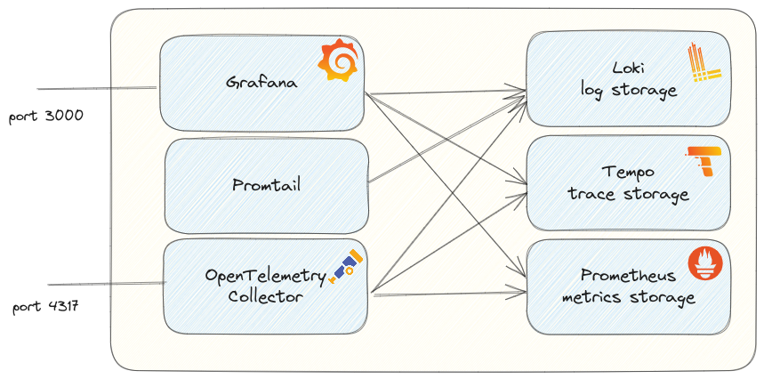
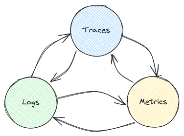
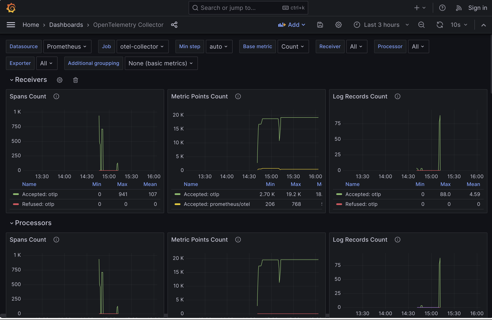

<div align="center">
  
</div>

# Observability Toolkit for local usage
A set of tools which can be used for local development which help with more insights in Observability.



# Explanation of the components

## OpenTelemetry Collector
[OpenTelemetry Collector](https://opentelemetry.io/docs/collector/) is the main entry point where all observability signals are collected.
With all kind of configuration you can choose what to do with it.

OpenTelemetry Collector sends the data to:
- [Loki](https://github.com/grafana/loki)   
  Loki is a log storage created by Grafana
- [Tempo](https://github.com/grafana/tempo)   
  Tempo is a trace storage created by Grafana
- [Prometheus](https://github.com/prometheus/prometheus)   
  Prometheus is a metric storage

## Grafana
[Grafana](https://github.com/grafana/grafana) is the visualisation tool to get insights in all observability metrics collected and stored.

# Power of correlation
The power of combining metrics, logs and traces together in 1 setup is that you can correlate these signals.    
    
The advantage of OpenTelemetry is standardisation on naming, that makes it way easier to hop between the metrics, traces and logs in all directions.
That will help to find the problems.

Configuration in Grafana can help to make it easier to hop from metrics (with exemplars) to traces for example (see [prometheus.yaml](./config/grafana/provisioning/datasources/prometheus.yaml)).    
That is already configured in this setup. Same holds from logs to traces (see [loki.yaml](./config/grafana/provisioning/datasources/loki.yaml)).   
Also the setup of spanmetrics and servicegraph is already configured (see [tempo.yaml](./config/grafana/provisioning/datasources/tempo.yaml)).   

# Start the setup

```shell
git clone https://github.com/cbos/observability-toolkit
cd observability-toolkit
docker-compose up -d 

```
Now you can open http://localhost:3000 to open Grafana.

# Run the demo app and generate load
There is a simple demo app, which helps to generate some traces, logs and metrics, but is not intended to show all capabilities.    
You can use the [demo services of OpenTelemetry](https://opentelemetry.io/docs/demo/) to see what is all available for all languages.

```shell
./run-observabilty-demo-app.sh 
```

To generate load:
```shell
./loadgen.sh 
```

# Default dashboards
- http://localhost:3000/d/observabilitystackOtelCollector/opentelemetry-collector


# Settings 

An number of settings can be tweaked by just setting environment variables.

```shell
# Specify the Grafana host port you want, other then the default 3000
export GRAFANA_HOST_PORT=3004

# Start the stack (in the background with -d)
docker-compose up -d 

# Now you can open Grafana at http://localhost:3004
```

| Variable name                        | Default                                     | Description                                                                                                             |
|--------------------------------------|---------------------------------------------|-------------------------------------------------------------------------------------------------------------------------|  
| LOKI_IMAGE_NAME                      | grafana/loki:2.9.3                          | Loki docker image                                                                                                       |
| LOKI_MEMORY_LIMIT                    | 200m                                        | Memory limit for Loki                                                                                                   |
| LOKI_MEMORY_RESERVATION              | 50m                                         | Memory reservation for Loki                                                                                             |
| LOKI_CPUS                            | 1                                           | Number of CPUs for Loki                                                                                                 |
| TEMPO_IMAGE_NAME                     | grafana/tempo:2.3.1                         | Tempo docker image                                                                                                      |
| TEMPO_MEMORY_LIMIT                   | 1g                                          | Memory limit for Tempo                                                                                                  |
| TEMPO_MEMORY_RESERVATION             | 50m                                         | Memory reservation for Tempo                                                                                            |
| TEMPO_CPUS                           | 1                                           | Number of CPUs for Tempo                                                                                                |
| PROMETHEUS_IMAGE_NAME                | prom/prometheus:v2.49.1                     | Prometheus docker image                                                                                                 |
| PROMETHEUS_MEMORY_LIMIT              | 250m                                        | Memory limit for Prometheus                                                                                             |
| PROMETHEUS_MEMORY_RESERVATION        | 75m                                         | Memory reservation for Prometheus                                                                                       |
| PROMETHEUS_CPUS                      | 1                                           | Number of CPUs for Prometheus                                                                                           |
| GRAFANA_IMAGE_NAME                   | grafana/grafana:10.2.3                      | Grafana docker image                                                                                                    |
| GRAFANA_MEMORY_LIMIT                 | 1g                                          | Memory limit for Grafana                                                                                                |
| GRAFANA_MEMORY_RESERVATION           | 200m                                        | Memory reservation for Grafana                                                                                          |
| GRAFANA_CPUS                         | 1                                           | Number of CPUs for Grafana                                                                                              |
| GRAFANA_HOST_PORT                    | 3000                                        | Port on host on which Grafana will be available                                                                         |
| OTEL_COLLECTOR_IMAGE_NAME            | otel/opentelemetry-collector-contrib:0.92.0 | OpenTelemetry Collector docker image                                                                                    |
| OTEL_COLLECTOR_MEMORY_LIMIT          | 200m                                        | Memory limit of OpenTelemetry Collector                                                                                 |
| OTEL_COLLECTOR_MEMORY_RESERVATION    | 50m                                         | Memory reservation for OpenTelemetry Collector                                                                          |
| OTEL_COLLECTOR_CPUS                  | 1                                           | Number of CPUs for OpenTelemetry Collector                                                                              |
| OTEL_COLLECTOR_HOST_PORT_GRPC        | 4317                                        | Port on host on which OpenTelemetry Collector will be available for OTLP format with GRPC                               |
| OTEL_COLLECTOR_HOST_PORT_HTTP        | 4318                                        | Port on host on which OpenTelemetry Collector will be available for OTLP format with HTTP                               |
| OTEL_COLLECTOR_HOST_PORT_PROMETHEUS  | 8889                                        | Port on host on which OpenTelemetry Collector will listen to expose prometheus data, like http://localhost:8889/metrics |
| PROMTAIL_IMAGE_NAME                  | grafana/promtail:2.8.7                      | Promtail docker image                                                                                                   |
| PROMTAIL_MEMORY_LIMIT                | 400m                                        | Memory limit of Promtail                                                                                                |
| PROMTAIL_MEMORY_RESERVATION          | 50m                                         | Memory reservation for Promtail                                                                                         |
| PROMTAIL_CPUS                        | 1                                           | Number of CPUs for Promtail                                                                                             |


# Inspired by 

This setup is created based on what I already used locally.    
The idea of adding a simple application for showcasing the setup comes fromL [grafana/docker-otel-lgtm](https://github.com/grafana/docker-otel-lgtm)    
The script for generating random load with a simple curl command comes from the [Grafana Beyla project](https://github.com/grafana/beyla/blob/main/examples/greeting-apps/loadgen.sh)

The OpenTelemetry Collector Grafana Dashboard is coming from
https://grafana.com/grafana/dashboards/15983-opentelemetry-collector/    
But it required some changes to get it working in this setup.