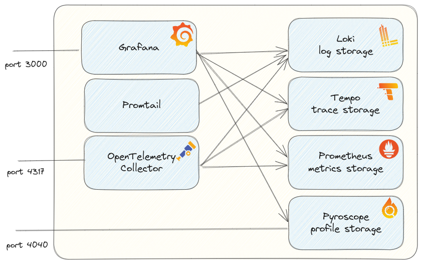

# Observability Toolkit for local usage
A set of tools which can be used for local development which help with more insights in Observability



# Todo

- [ ] Add promtail
- [ ] Update documentation
- [ ] Spanmetrics and servicegraph with OpenTelemetry Collector instead of Tempo (make tail sampling possible)
- [ ] Default dashboards

# Settings 

```shell
# Specify the Grafana host port you want, other then the default 3000
export GRAFANA_HOST_PORT=3004

# Start the stack (in the background with -d)
docker-compose up -d 

# Now you can open Grafana at http://localhost:3004
```

| Variable name                     | Default                                     | Description                                                                               |
|-----------------------------------|---------------------------------------------|-------------------------------------------------------------------------------------------|  
| LOKI_IMAGE_NAME                   | grafana/loki:2.9.3                          | Loki docker image                                                                         |
| LOKI_MEMORY_LIMIT                 | 200m                                        | Memory limit for Loki                                                                     |
| LOKI_MEMORY_RESERVATION           | 50m                                         | Memory reservation for Loki                                                               |
| LOKI_CPUS                         | 1                                           | Number of CPUs for Loki                                                                   |
| TEMPO_IMAGE_NAME                  | grafana/tempo:2.3.1                         | Tempo docker image                                                                        |
| TEMPO_MEMORY_LIMIT                | 1g                                          | Memory limit for Tempo                                                                    |
| TEMPO_MEMORY_RESERVATION          | 50m                                         | Memory reservation for Tempo                                                              |
| TEMPO_CPUS                        | 1                                           | Number of CPUs for Tempo                                                                  |
| PROMETHEUS_IMAGE_NAME             | prom/prometheus:v2.49.1                     | Prometheus docker image                                                                   |
| PROMETHEUS_MEMORY_LIMIT           | 250m                                        | Memory limit for Prometheus                                                               |
| PROMETHEUS_MEMORY_RESERVATION     | 75m                                         | Memory reservation for Prometheus                                                         |
| PROMETHEUS_CPUS                   | 1                                           | Number of CPUs for Prometheus                                                             |
| GRAFANA_IMAGE_NAME                | grafana/grafana:10.2.3                      | Grafana docker image                                                                      |
| GRAFANA_MEMORY_LIMIT              | 1g                                          | Memory limit for Grafana                                                                  |
| GRAFANA_MEMORY_RESERVATION        | 200m                                        | Memory reservation for Grafana                                                            |
| GRAFANA_CPUS                      | 1                                           | Number of CPUs for Grafana                                                                |
| GRAFANA_HOST_PORT                 | 3000                                        | Port on host on which Grafana will be available                                           |
| OTEL_COLLECTOR_IMAGE_NAME         | otel/opentelemetry-collector-contrib:0.92.0 | OpenTelemetry Collector docker image                                                      |
| OTEL_COLLECTOR_MEMORY_LIMIT       | 200m                                        | Memory limit of OpenTelemetry Collector                                                   |
| OTEL_COLLECTOR_MEMORY_RESERVATION | 50m                                         | Memory reservation for OpenTelemetry Collector                                            |
| OTEL_COLLECTOR_CPUS               | 1                                           | Number of CPUs for OpenTelemetry Collector                                                |
| OTEL_COLLECTOR_HOST_PORT_GRPC     | 4317                                        | Port on host on which OpenTelemetry Collector will be available for OTLP format with GRPC |
| OTEL_COLLECTOR_HOST_PORT_HTTP     | 4318                                        | Port on host on which OpenTelemetry Collector will be available for OTLP format with HTTP |
| PROMTAIL_IMAGE_NAME               | grafana/promtail:2.8.7                      | Promtail docker image                                                                     |
| PROMTAIL_MEMORY_LIMIT             | 400m                                        | Memory limit of Promtail                                                                  |
| PROMTAIL_MEMORY_RESERVATION       | 50m                                         | Memory reservation for Promtail                                                           |
| PROMTAIL_CPUS                     | 1                                           | Number of CPUs for Promtail                                                               |


# Inspired by 

